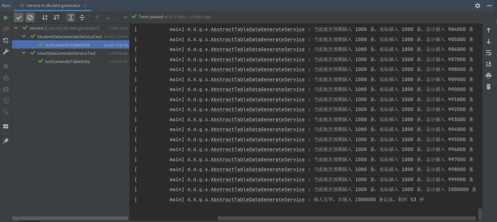
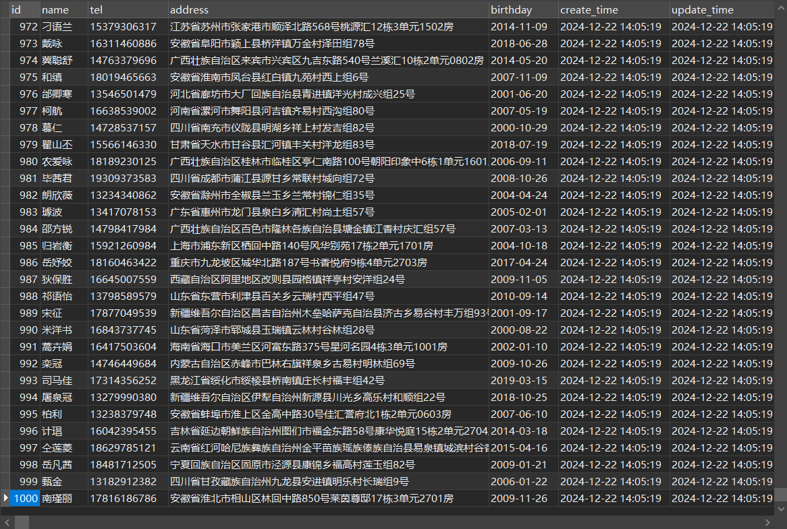

# db-data-generator
数据库数据生成器，用于往数据表中插入假数据，基于 springboot + mybatis 构建。

随机数据生成组件：使用国人开源的 [common-random](https://github.com/yindz/common-random)

## 效果




## 使用示例
内置了 2 个示例：t_user、t_student，可按以下步骤使用
1. 执行 document/sql/DDL.sql 建表
2. 修改 yml 中的数据库连接配置
3. 执行单元测试，往数据表中插入记录

## 向自定义的数据表中插入记录
1. 创建数据表。
2. 在 entity 包下创建对应的实体类。
3. 在 mapper 包下创建对应的 mapper 接口，并在 resources/mapper 下编写对应的 xml 映射文件。
    ```java
    // 继承 TableMapper，泛型指定对应的实体类，无需添加方法
    public interface UserMapper extends TableMapper<User> {
    
    }
    ```
    
    ```xml
    <!-- 实现 TableMapper 接口中定义的 2 个方法即可：① batchInsert 批量插入，② truncateTable 清空表 -->
    
    <?xml version="1.0" encoding="UTF-8" ?>
    <!DOCTYPE mapper
            PUBLIC "-//mybatis.org//DTD Mapper 3.0//EN"
            "http://mybatis.org/dtd/mybatis-3-mapper.dtd">
    
    <mapper namespace="com.chy.db.data.generator.mapper.UserMapper">
    
        <!-- 插入使用的是 INSERT IGNORE INTO，插入时会先检查是否违背唯一约束，违背则跳过，不违背才插入 -->
        <insert id="batchInsert">
            INSERT IGNORE INTO t_user
            (`username`, `tel`, `email`, `address`, `birthday`)
            VALUES
            <foreach collection="records" item="user" separator=",">
                (#{user.username}, #{user.tel}, #{user.email}, #{user.address}, #{user.birthday})
            </foreach>
        </insert>
    
        <delete id="truncateTable">
            TRUNCATE TABLE t_user
        </delete>
    
    </mapper>
    ```

4. 在 service.impl 包下编写对应的 Service 实现类：继承`AbstractTableDataGenerateService`，重写`getMapper()`、`generateRecord()`方法。
    ```java
    /**
     * 用户表数据生成服务实现
     *
     * @author chy
     */
    @Slf4j
    @Service
    public class UserDataGenerateService extends AbstractTableDataGenerateService<User> {
    
        @Resource
        private UserMapper userMapper;
    
        @Override
        protected TableMapper<User> getMapper() {
            return userMapper;
        }
    
        @Override
        public User generateRecord() {
            return User.builder()
                    .username(PersonInfoSource.getInstance().randomNickName(15))
                    .tel(PersonInfoSource.getInstance().randomChineseMobile())
                    .email(InternetSource.getInstance().randomEmail(20))
                    .address(AreaSource.getInstance().randomAddress())
                    .birthday(DateTimeSource.getInstance().randomPastDate(LocalDate.of(2010, 1, 1), 365 * 30L))
                    .build();
        }
    
    }
    ```

5. 编写并运行单元测试
    ```java
    /**
     * UserDataGenerateService 单元测试
     *
     * @author chy
     */
    public class UserDataGenerateServiceTest extends ApplicationTests {
    
        @Resource
        private UserDataGenerateService userDataGenerateService;
    
        @Test
        public void testGenerateTableData() {
            // 清空表
            userDataGenerateService.truncateTable();
            // 插入记录
            userDataGenerateService.batchInsertRecords(1000000);
        }
    
    }
    ```
